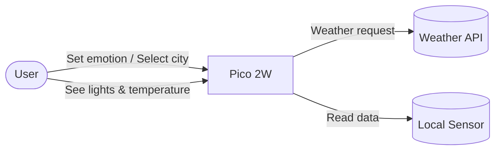
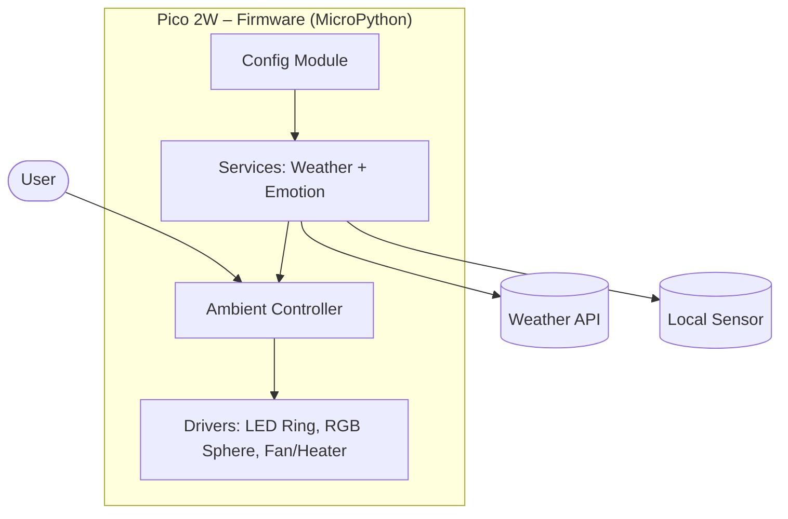

*This is the technical design which satisfies the user stories.*

# Step 3: Architecture – EmotionalTerrarium

## Introduction

This document describes the technical architecture of the EmotionalTerrarium.
It explains how the system is structured, which components it contains, and how they interact.
The goal is to provide a clear design that connects user stories to the implementation.

## 1. Architecture Overview

- Short description of the system.
- Key idea: a Raspberry Pi Pico 2W running MicroPython controls sensors and actuators, connects to the internet, and displays both weather and emotions inside a terrarium.
- The architecture is designed to be **modular**, **resilient**, and **simple** for prototyping.

## 2. Context Diagram (C4 Level 1)

Actors and external systems:

- **User** → sets emotions, selects city or mode.
- **Weather API** → provides remote weather data.
- **Pico 2W Device** → runs firmware, controls LEDs, sensors, actuators.
- **Local Sensors** (optional) → provide ambient weather data.

## 3. Containers (C4 Level 2)

Main building blocks of the system:

- **Firmware (MicroPython)**
  - Handles WiFi, HTTP requests, LED control, emotion input, sensor data.
- **Weather Service**
  - Fetches weather from API, IP-based location, or local sensors.
- **Emotion Service**
  - Maps emotions to RGB colors for the central sphere.
- **Ambient Controller**
  - Combines weather + emotion into LED patterns.
- **Config Module**
  - Stores WiFi credentials, city, and settings.

## 4. Components (C4 Level 3)

Detailed modules inside the firmware:

- `/drivers` → hardware drivers (LEDs, sensors, fan/heater).
- `/services` → weather service, emotion service, mapping utilities.
- `/controllers` → main control logic (ambient controller, demo mode).
- `/config` → configuration and secrets.
- `/playground` → experimental/test scripts.

## 5. Technology Choices

- **Microcontroller:** Raspberry Pi Pico 2W
- **Language:** MicroPython
- **Networking:** WiFi (built-in), HTTP requests
- **LEDs:** WS2812B ring (Neopixel) + RGB overhead lights
- **Sensors:** DHT22 for temperature/humidity
- **API:** Open-Meteo

## 6. Quality Attributes

- **Simplicity** → modular code, clear folder structure.
- **Resilience** → auto-reconnect WiFi, error handling.
- **Responsiveness** → emotion changes visible in <1s.
- **Portability** → easy to redeploy with config files.

## 7. Architecture Decisions

Key choices documented (ADR style):

1. Use MicroPython instead of C++ for rapid prototyping.
2. Use WS2812B LEDs for flexible colors.
3. Fetch weather primarily from API, with fallbacks (IP geolocation, local sensor).
4. Support demo mode for offline showcase.

---

## 8. Next Steps

- Add diagrams for context and containers.
- Link each component to the coding roadmap milestones.
- Update when new services (e.g., sensor integration) are added.
